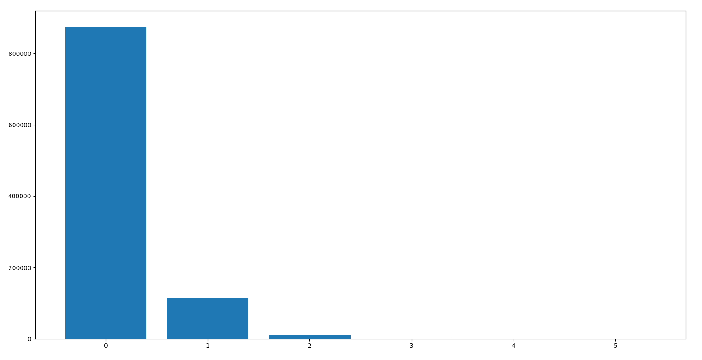
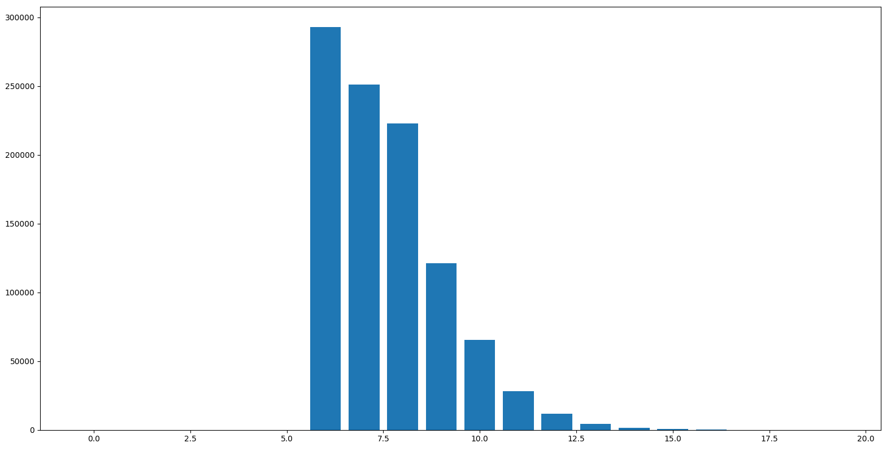
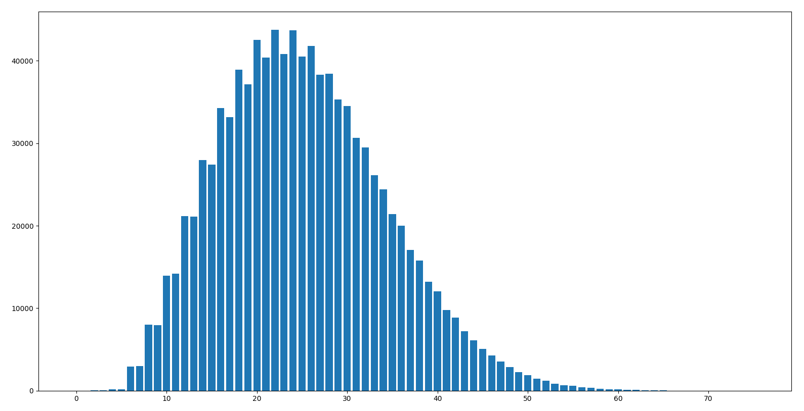
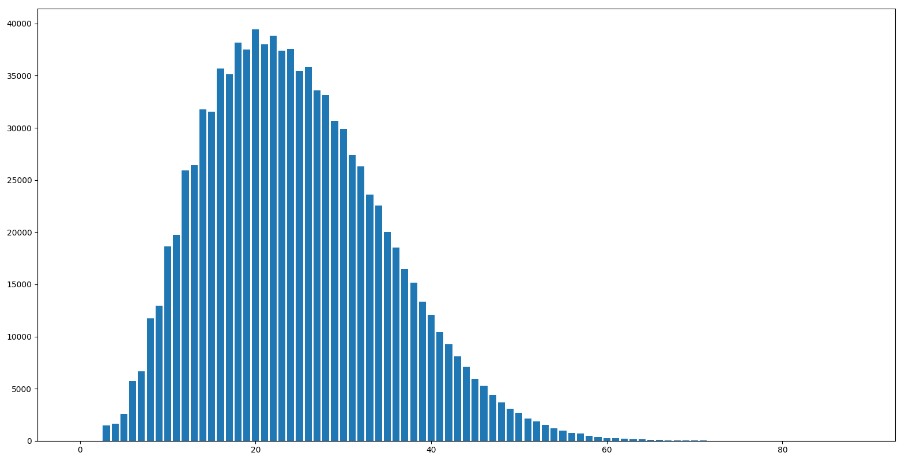
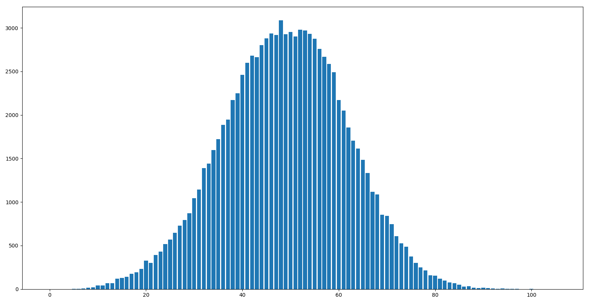
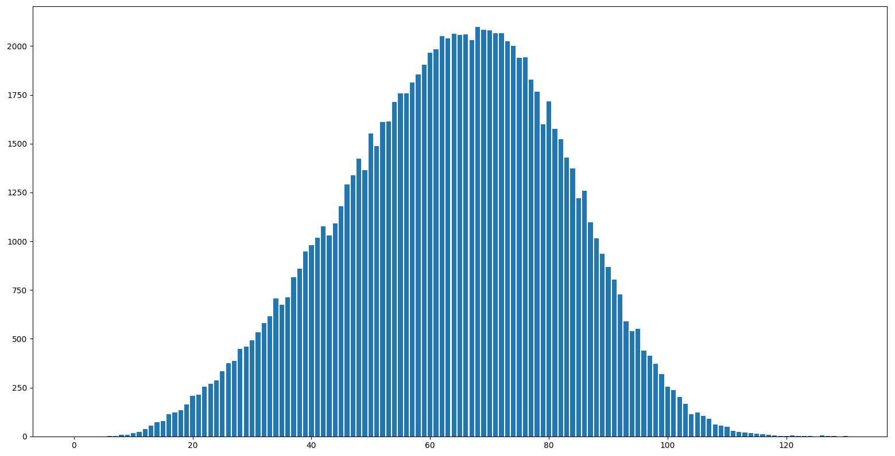

# Snake

In this repository, we created the game Snake to play in the terminal and some different bots that play the game automatically.

## The game

There are two different versions of the game. One is played on a square and the other one is played on a torus. This means that in the square version the player dies when running into a wall and in the torus version the player comes out on the other side of the field.

In the two files, the user can change all of the variables, including the type of bot they want to use and all of the following variables, simply by changing them as at the very end of the code (to change the bot, type in the name of the class defined at the top of the file; to change other variables, see description below).

The game is visualized using the pygame library. There is a light mode and a dark mode that can be turned of directly in the code using the darkMode variable.

#### Apples

The user can choose the number of apples that appear simultaneously in the game. This works for the game itself and for all of the bots.
This can be done directly in the code using the `numOfApples` variable.

#### Obstacles

The user can also choose if they want any obstacles in the game and where they should be. This can be done by adding a list with the two coordinates to the `obstacles` list directly in the code. The coordinates start at [0, 0] in the top left corner and go to [15, 15] in the bottom right corner. The top right corner is [15, 0] and the bottom left corner is [0, 15].

Example: `obstacles = [[3, 4], [6, 1], [10, 8]]`

#### Portals

The user can add a pair of portals to the field if they want. To do this, they need to specify the coordinates of the two portals in the `portals` list. To see how the coordinates are generated, see above. When the snake goes into one portal, it is instantly teleported to the other one. When going out of the second portal, the snake can also change directions.

Example: `portals = [[4, 6], [13, 5]]`

### Cool fields

We've added two game configurations showing the possibilities of the different fields shown above. These can be found in the `cool fields` folder.

The first game called `l.py` shows a very simple use of the obstacles. In this game, the top right quarter of the field is full of obstacles, meaning the field takes up an L-shape.

The second game called `two_parts.py` is a bit more complicated. There is a diagonal line of obstacles connecting the bottom left and top right corner of the field. This divides the field into two parts that are only connected by a pair of portals.

Both of these work with the dijkstra bot on a square field. Maybe we will add more of these examples in the future, but the user is invited to experiment with the different variables to create their own versions of the game.

## NEAT

We are currently in the process of adding an AI to our collection of bots. Unfortunately, there have been some problems regarding that. To train the AI we are using the `neat-python` module, but that hasn't quite worked out how we planned. As soon as we fix our issues, the files in the NEAT folder will be much more organized, so we recommend not looking into that folder as to not get confused.

## Bots

To get the data for the bots, we used get_data.py. The program runs a certain amount of games (mostly 1 million) and stores the results in a text file.
To see the exact number of games where the snake scored a certain number of points, see data folder and the results file in the folder for each bot.

### Random Bot

The random bot is pretty simple: The snake performs a random possible move every turn. That's it.

#### Square

Average: 0.137394

Histogram:

One can see that the bot doesn't do that well, but it did score 5 once, so that's more than we expected.

#### Torus

Average: 7.584119

Histogram:

Now that the bot can't die by running into a wall, the minimum score is 6. With that length it is possible for the snake to surround itself and die. After that, the score drops pretty fast though. Still, the average is pretty high for a bot that only performs random moves.

### Simple Bot

The simple bot tries to get closer to the apple, firstly in the horizontal direction and then in the vertical direction. If the snake can't get closer in either direction, it makes a random move.

#### Square

Average: 25.150566

Histogram:

This data follows a bell curve slightly tilted to the left. Our theory is that the probability of dying is low at the beginning and then rises with the score. So there are few games with a low score and few games with a high score because the bot was likely to die beforehand.

#### Torus

Average: 24.572957

Histogram:

For the torus the bot also follows a bell curve. What's surprising is that the average is lower than that of the square. But the scores are also more widely spread with the highest score being 88 instead of 75.

### Dijkstra Bot

The Dijkstra Bot uses the Dijkstra Algorithm, that counts the number of steps it takes to get to the apple for each field and lets the snake move to the smallest number near it. This is also represented on the field with a color gradient indicating where the snake wants to go.

#### Square

Average: 48.84104

Histogram:

Unlike the simple bot, the plot of this bot seems to be tilted to the right. This bot also performs the best of all the bots in the square field (excluding the hamiltonian bot). With a top score of 105 it filled up more than 40% of the field.

#### Torus

Average: 63.53288

Histogram:

This is by far the best bot (except for the hamiltonian bot). With a high score of 130 it filled up more than half of the field. Like the other graph, this bell curve is also tilted to the right.

### Hamiltonian Bot

The Hamiltonian Bot follows a simple Hamiltonian Cycle and thus always scores 253, the maximum possible score in (our version of) the game.
It is most certainly not the most efficient bot accounting for the number of steps taken, but the absolute score is optimal.

## What's up for the future?

In the future, we want to gather data for the bots using a different number of apples, obstacles and portals. We're excited to see how those extra variables affect the results of the different bots.
We're also working on a perfect bot that scores the highest (also accounting for the number of steps taken).
Another plan is implementing a multiplayer mode, where the player can battle against a bot in the same field, in a different field, or where two players can play against each other.
A big project for the future is adding documentation including pictures and gifs to a website, so the project is more accessible. This also includes a version of the game to play in the browser.