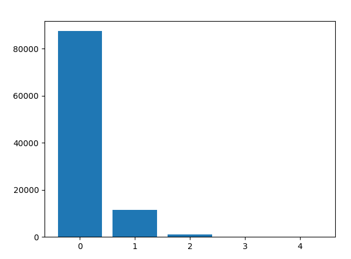
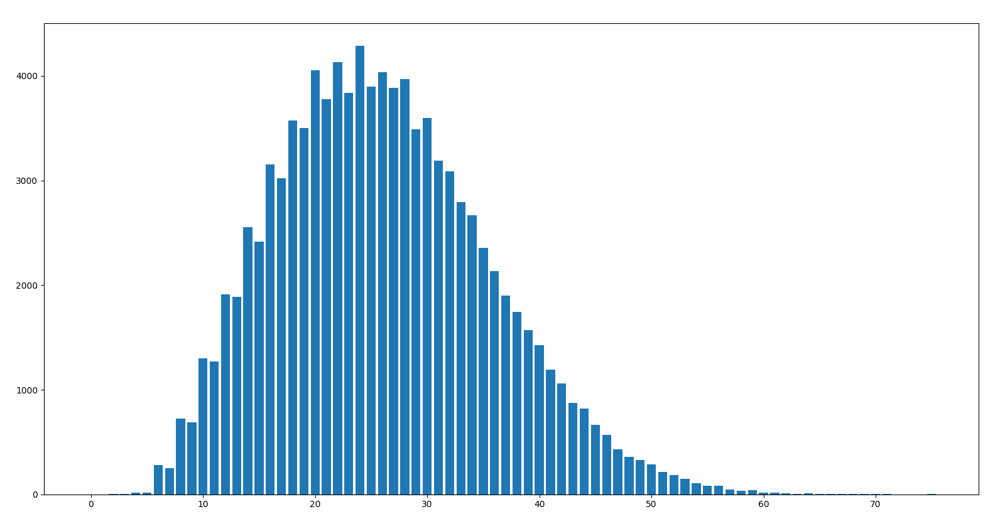

# Snake

In this repository, we created the game Snake to play in the terminal and some different bots that play the game automatically.

## Bots

To get the data for the bots, we used get_data.py. The program runs a certain amount of games (mostly 1 million) and stores the results in a text file.
To see the exact number of games where the snake scored a certain number of points, see data folder and the results file in the folder for each bot.

### Random Bot

The random bot is pretty simple: The snake does a random possible move every turn. That's it.

#### Data

Average: 0.137394

Histogram:

One can see that the bot doesn't do that well, but it did score 5 once, so that's more than we expected.

### Simple Bot

The simple bot tries to get closer to the apple, firstly in the horizontal direction and then in the vertical direction. If the snake can't get closer in either direction, it makes a random move.

#### Data

Average: 25.150566

Histogram:

The score is much more widely spread, with the record being a score of 75, scored twice.
For some reason, the bot seems to score even numbers of scores much more that odd ones. We unfortunately don't know why that is, but it seems important to point it out.

### Dijkstra Bot

The Dijkstra Bot uses the Dijkstra Algorithm, that counts the number of steps it takes to get to the apple for each field and lets the snake move to the smallest number near it. The numbers are also printed on the field while the bot is playing, so it is easier to see which path the bot is following.

#### Data

Average: 48.084333

With only 3000 games, the data for the Dijkstra Bot is less representative of the real strength of the bot. That's why there is no graph yet, but we are planning to run more games to get a nice graph to show here.

### Hamiltonian Bot

The Hamiltonian Bot follows a simple Hamiltonian Cycle and thus always scores 253, the maximum possible score in (our version of) the game.
It is most certainly not the most efficient bot accounting for the number of steps taken, but the absolute score is optimal.

### What's up for the future?

In the future, we want to try changing the playing field from a square to a torus, meaning that you come out the other side when going into a wall. We're excited to see how that changes the results of the different bots.
We also want to program a new bot with a neural network using NEAT (https://en.wikipedia.org/wiki/Neuroevolution_of_augmenting_topologies). That would be our first real experience with AI and we're looking forward to seeing how that will go.